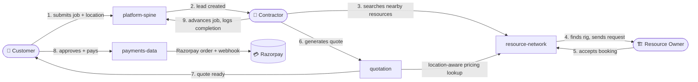

<div align="center">


# 🛠️ Borewell Platform

**A location-aware marketplace connecting borewell customers, contractors, and independent resource owners in Tamil Nadu.**

*Piloting in Madurai district (Virudhunagar and neighboring villages) — expandable from there.*

[]()
[]()
[]()
[]()

</div>

---

## 📍 What this is

Customers request a borewell and get a **location-aware quote**. Contractors manage leads, generate quotes, and find nearby rigs and equipment through a **real cross-owner marketplace search** — not just their own fleet. Resource owners list their own equipment and accept or reject booking requests directly, independent of any single contractor.



> **📖 Read the docs in this order:** `docs/rfc/0001-microservices-architecture.md` for the original architecture decision → `docs/adr/*` for every real change since then → `AGENTS.md` for how to work in this codebase without guessing. **The ADRs are the source of truth where they conflict with the original PRD/SRS** — most notably `ADR-0002` (one unified frontend, not three) and `ADR-0004` (a real multi-owner marketplace, not a single contractor's fleet — the "Zomato for drilling rigs" pivot).

> 🤖 **AI coding agents: read `AGENTS.md` first**, then the nested `AGENTS.md` files under `services/*/`, `apps/*/`, and `packages/contracts/`. They exist specifically to stop hallucinated endpoints and unverified "done" claims.

---

## 🧩 Services & Current State

### Backend — 4 independent services, one database each

| # | Service | Owner | Port | What it does |
|---|---|:---:|:---:|---|
| 🔐 | **`platform-spine`** | Dev A | `8001` | Identity/RBAC (`customer` · `contractor` · `resource_owner` · `admin`), job lifecycle state machine, job completion + quoted-vs-actual variance |
| 💰 | **`quotation`** | Dev B | `8002` | Configurable pricing engine, **location-aware depth estimation** for pilot service areas, versioned quotations |
| 🗺️ | **`resource-network`** | Dev C | `8003` | Multi-owner resource inventory, **cross-owner nearest-resource search**, booking request → accept/reject flow, pilot service-area data |
| 💳 | **`payments-data`** | Dev D | `8004` | DB-enforced idempotent payments, **real Razorpay integration** (order creation + signed webhook) — code-complete, needs live API keys |

### Frontend — two active surfaces, one reference set

| | App | Stack | Status |
|---|---|---|---|
| 🌐 | **`apps/web-app`** | React + Vite | One unified app for all 4 roles (`ADR-0002`) — real dashboards, real API wiring |
| 📱 | **`apps/borewell-native`** | Expo / React Native | Scaffolded for iOS + Android — login, role routing, and secure session persistence work now; screens are placeholders with the build order documented in its own `AGENTS.md` |
| 🧰 | **`apps/shared-ui`** | Plain JS | API client + auth helpers shared by `web-app` — **not** in the same npm workspace as `borewell-native` (Metro doesn't hoist well; see that app's `AGENTS.md`) |
| 🗄️ | `apps/contractor-app`, `customer-app`, `resource-owner-app` | React | **Deprecated**, kept as reference only — see each folder's `DEPRECATED.md`. Don't build here. |

---

## 🚀 Quick Start — Local Development

**Prerequisites:** Docker/Podman · Docker Compose · Python 3.11+ · Node.js 20+

```bash
# 1️⃣  Clone the repo

# 2️⃣  Set the one required secret
cp services/platform-spine/.env.example services/platform-spine/.env
#    → edit JWT_SECRET to any long random string

# 3️⃣  Bring up all 4 backend services + web-app + Postgres + Redis
make up

# 4️⃣  Confirm every service is healthy
curl localhost:8001/healthz   # platform-spine
curl localhost:8002/healthz   # quotation
curl localhost:8003/healthz   # resource-network
curl localhost:8004/healthz   # payments-data

# 5️⃣  Open the app
open http://localhost:5173
```

**Working on the native app instead?**

```bash
cd apps/borewell-native
cp .env.example .env          # use your machine's real LAN IP, not localhost
npm install
npm start                     # then press i (iOS) or a (Android)
```

💡 **Set up pre-commit hooks once**, so lint and contract-drift issues get caught before you commit, not just in CI:

```bash
pip install pre-commit && pre-commit install
```

---

## ☁️ Production Deployment

Single-VM deployment via `docker-compose.prod.yml` — a deliberate choice per `Architecture §10`: no managed orchestration until there's real multi-contractor load to justify it.

**📘 Full runbook: [`docs/deployment/PRODUCTION.md`](docs/deployment/PRODUCTION.md)** — secrets setup, first deploy, verification, HTTPS, Razorpay dashboard setup, redeploys, rollback.

```bash
make prod-up     # 🏗️  build + start the production stack
make prod-logs   # 📜  follow logs
make prod-down   # 🛑  stop it
```

---

## 🔄 Using the App — a full walkthrough

Register as any of the four roles from the registration screen. Each role routes to its own dashboard (**client-side routing is UX only** — the real access-control boundary is every backend service's `require_role` dependency; see e.g. `resource-network/tests/test_resources.py`).

| Step | Who | What happens |
|:---:|---|---|
| 1️⃣ | 🏗️ **Resource Owner** | Registers → lists a rig or equipment (location + hourly rate) in **My Fleet** |
| 2️⃣ | 👤 **Customer** | Submits a job request with a location |
| 3️⃣ | 👷 **Contractor** | Sees the lead → **Find Nearby Rigs** searches the real marketplace → sends a booking request |
| 4️⃣ | 🏗️ **Resource Owner** | Accepts or rejects the request in **Booking Requests** |
| 5️⃣ | 👷 **Contractor** | Generates a quotation — **location-aware** if the job falls inside a configured pilot service area, otherwise the contractor's flat assumption |
| 6️⃣ | 👤 **Customer** | Reviews the quote (depth range + confidence badge are *always* shown, per `UI/UX §7`) and approves it |
| 7️⃣ | 👤 **Customer** | Pays via **Razorpay Checkout** — `payments-data` creates the order, the signed webhook confirms it (needs live keys in production — see `PRODUCTION.md §4`) |
| 8️⃣ | 👷 **Contractor** | Advances the job through its lifecycle, logs actual depth/cost at completion — variance is computed automatically |

---

## 📸 Screenshots & Demo

> **No real screenshots or demo video exist yet.** `web-app`'s dashboards are wired to the real backend but not visually designed (see `apps/AGENTS.md`), and `apps/borewell-native` has a working login screen with placeholder dashboards beyond that (see that app's own `AGENTS.md` for the exact build order). Nothing here is polished enough yet to be worth screenshotting — this section is a placeholder with a real checklist, not filled with anything fabricated to look finished before it is.

**To add real media once there's something worth showing:**

1. Drop image files into `docs/assets/screenshots/` (create the folder) and video files or links into `docs/assets/demo/`.
2. Reference them here with standard markdown image syntax: ``.
3. For a demo video, either commit a short `.gif` directly (renders inline on GitHub, no extra clicks) or link out to a hosted video (YouTube/Loom) — a large `.mp4` committed to git bloats the repo and isn't the right place for it.

**What's worth capturing first, in order of usefulness:**

| Priority | What | Why |
|:---:|---|---|
| 1 | Customer flow: location entry → quote (with depth/confidence badge) → payment → tracking | The core product loop, most likely to be shown to a client or investor |
| 2 | Contractor: nearby-resource search results + a booking request being accepted | Demonstrates the actual marketplace mechanic (`ADR-0004`) that differentiates this from a plain lead-tracker |
| 3 | Native app: login + role routing | Proves the mobile path is real, even before its screens are built out |

---

## 🧪 Raw API Developer Dashboard *(optional, secondary to `web-app`)*

`tools/demo-frontend` is a single-file, dependency-free HTML dashboard for exercising every backend endpoint directly — useful for verifying service health without going through the full product UI.

```bash
python3 -m http.server 3000 --directory tools/demo-frontend
# → http://localhost:3000
```

---

## ⚙️ Development Commands

```bash
make test             # 🧪 run every backend service's test suite
make up                # 🚀 start the dev stack (backend + web-app + DBs + redis)
make down              # 🛑 stop everything, remove volumes
make lint              # 🔍 ruff check — backend
make lint-frontend     # 🔍 eslint — web-app + shared-ui
make lint-all          # 🔍 both of the above
make check-contracts   # 📐 verify no service exposes an undeclared endpoint
make migrate           # 🗃️  alembic upgrade head, all 4 backend services
make prod-up           # ☁️  build + start the production stack (needs .env.prod)
make prod-down         # 🛑 stop the production stack
make prod-logs         # 📜 follow production logs
```

---

## ✅ Continuous Integration

Every workflow lives in `.github/workflows/`, runs on every push/PR, and is reproducible locally with the exact command it runs — no CI-only magic.

| Workflow | Checks | Scope |
|---|---|:---:|
| `ci-platform-spine.yml`<br>`ci-quotation.yml`<br>`ci-resource-network.yml`<br>`ci-payments-data.yml` | That service's `pytest` suite + `ruff check` + `check_contract.py` | 🎯 path-scoped |
| `ci-frontend.yml` | `npm install` from repo root (workspace-aware) + `npm run lint` + `npm run build --workspace=web-app` | 🎯 `apps/**` |
| `ci-borewell-native.yml` | `eslint-config-expo` lint + a real **Metro bundle** for iOS (proves every import in the app actually resolves) | 🎯 `apps/borewell-native/**` |
| `ci-deployment.yml` | Both compose files parse + every Dockerfile in the repo actually builds | 🎯 compose/Dockerfile changes |
| `ci-integration.yml` | 🔥 **The one workflow that boots all 4 real services via `docker compose up`** and runs a genuine cross-service flow over real HTTP — registration, job creation, marketplace search, booking accept, location-aware quotation, approval, payment, full lifecycle, completion + variance | 🌍 every push/PR, unscoped |

> **Why a separate integration workflow?** Every per-service suite mocks its cross-service calls by design (see `fake_job_fetcher` in `services/quotation/tests/conftest.py`) — correct for testing one service in isolation, but it means no other workflow ever proved the services work *together*. This was an explicit, pre-existing requirement in `Borewell_05_Development_Plan.md` ("the Milestone 2 end-to-end flow, run via Docker Compose in CI") that nothing satisfied until `ci-integration.yml`.

> ⚠️ **What CI does *not* cover:** Redis event consumption, mostly. `platform-spine` now has one real consumer (`payment.completed` → advances a job from `completion` to `payment`, enforcing `BR-03` — see `services/platform-spine/app/payment_consumer.py`), tested directly (`tests/test_payment_consumer.py`) and verified against a real Redis instance during development, but **not yet exercised by `ci-integration.yml`** (that workflow doesn't publish a real `payment.completed` event mid-flow). The other three events (`job.created`, `job.quoted`, `job.completed`) are still publish-only — confirmed by `grep -rn "subscribe" services/*/app/` returning exactly one file. A green CI run is not a claim that every event-driven reaction works, only the one that's actually wired.

---

## 📁 Before you touch the top-level structure

Read **`STRUCTURE.md`** first. New services and apps are added by following the existing template folders — not by renaming or restructuring what's already here.

## 📐 Contracts

`packages/contracts/` is the source of truth for all inter-service communication — OpenAPI specs for synchronous calls, JSON Schema for events. **Change contracts there first**, in a reviewed PR, before changing any service code that depends on them.

---

<div align="center">

*Questions about a specific decision? Check `docs/adr/` before asking — it's probably already answered there.*

</div>
